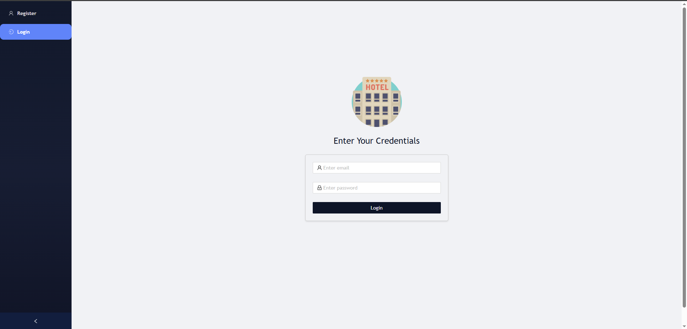
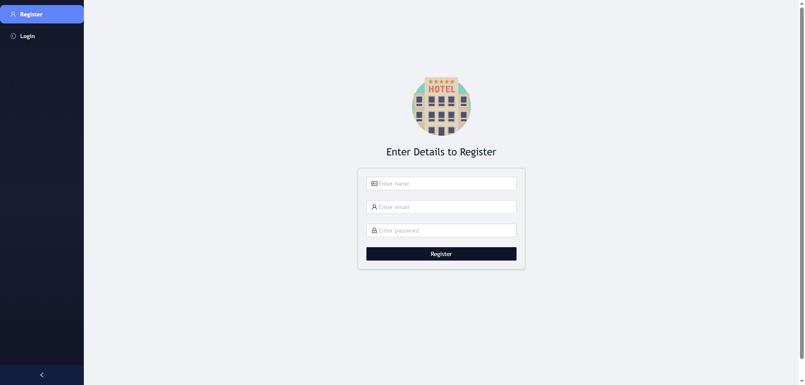
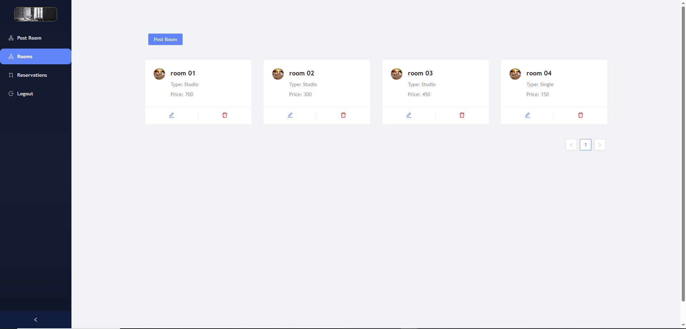
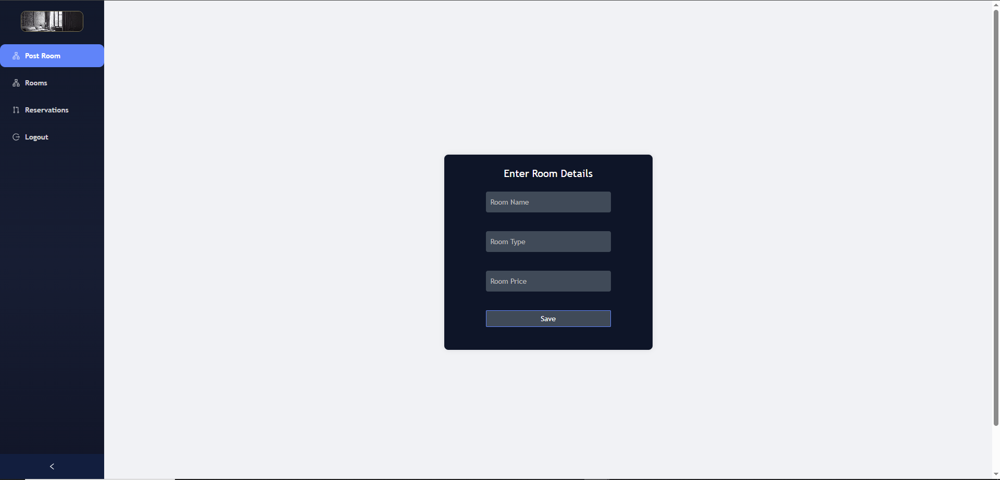
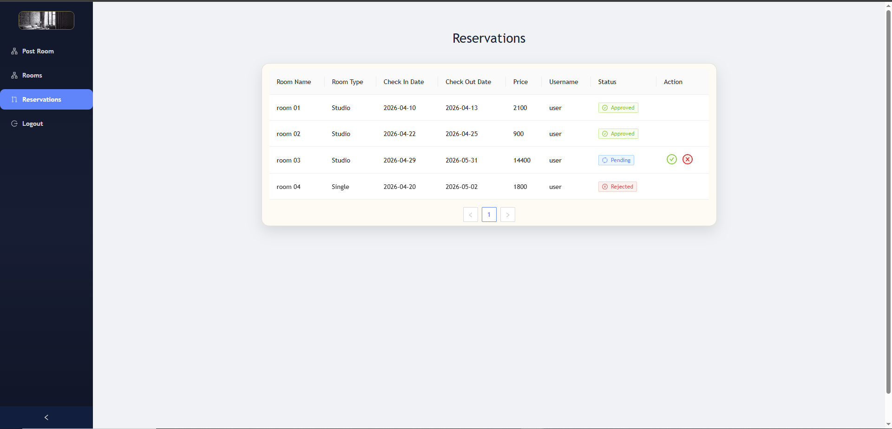
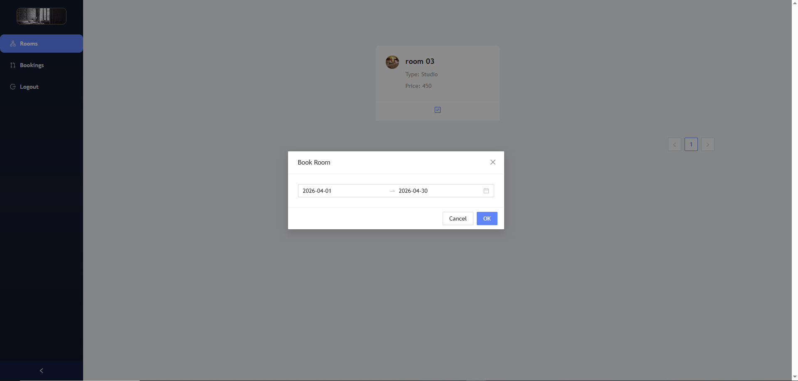
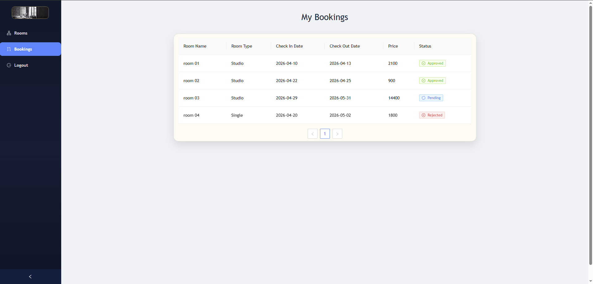

<h1 align="center">Hotel Management</h1>

<p align="center">
  <strong>Languages:</strong><br>
  <a href="README.pt.md">Portuguese</a> |
  <a href="README.md">English</a>
</p>

Hotel Management é uma **aplicação full-stack de reservas de hotel** desenvolvida com **Spring Boot**, **Angular** e **MySQL**. O sistema oferece uma experiência com papéis distintos para **administradores** e **clientes**, com autenticação JWT, rotas protegidas na API, gerenciamento de quartos e fluxo de reservas.

O sistema oferece:

- Cadastro e login de usuários com autenticação baseada em JWT
- Tratamento automático de papéis `ADMIN` e `CUSTOMER`
- Gerenciamento de quartos pelo admin com criação, edição, exclusão e listagem paginada
- Navegação de quartos disponíveis para clientes
- Solicitação de reservas com seleção de intervalo de datas e cálculo automático do valor total
- Fluxo de análise de reservas pelo admin com aprovação ou rejeição
- Documentação da API com Swagger/OpenAPI

## 🎯 Motivação do Projeto

Este projeto foi construído para praticar um fluxo realista de gerenciamento hoteleiro, com separação clara entre regras de negócio no backend e experiência do usuário no frontend.

O principal objetivo foi implementar uma pequena plataforma de reservas, mas completa o suficiente para demonstrar:

- autenticação segura com Spring Security e JWT
- acesso baseado em papéis para áreas de admin e cliente
- operações CRUD para quartos do hotel
- ciclo de vida de reservas, desde a solicitação até a aprovação

## ✅ Funcionalidades Atuais

### ⚙️ Backend (Spring Boot + MySQL)

- API de autenticação:
  - `POST /api/auth/signup`
  - `POST /api/auth/login`
- API do cliente:
  - `GET /api/customer/rooms/{pageNumber}`
  - `POST /api/customer/book`
  - `GET /api/customer/bookings/{userId}/{pageNumber}`
- API do admin:
  - `POST /api/admin/room`
  - `GET /api/admin/rooms/{pageNumber}`
  - `GET /api/admin/room/{id}`
  - `PUT /api/admin/room/{id}`
  - `DELETE /api/admin/room/{id}`
  - `GET /api/admin/reservations/{pageNumber}`
  - `PUT /api/admin/reservation/{reservationId}/{reservationStatus}`
- Segurança e infraestrutura:
  - filtro JWT para endpoints protegidos
  - autorização baseada em papéis `ADMIN` e `CUSTOMER`
  - configuração stateless com Spring Security
  - CORS habilitado para integração local entre frontend e backend
  - configuração de Swagger UI e OpenAPI
  - endpoints de health/info com actuator
- Regras de negócio:
  - novos usuários são criados como `CUSTOMER`
  - uma conta padrão de admin é criada automaticamente no startup, caso não exista
  - a listagem de quartos para clientes retorna apenas quartos disponíveis
  - reservas começam com status `PENDING`
  - o valor total da reserva é calculado com base no preço do quarto x quantidade de dias
  - ao aprovar ou rejeitar uma reserva, o status é atualizado
  - reservas aprovadas marcam o quarto como indisponível
- Persistência e testes:
  - entidades JPA para `User`, `Room` e `Reservation`
  - testes de repositório, serviço e controller
  - configuração H2 em memória para testes do backend

### 🖥️ Frontend (Angular + NG-ZORRO)

- Telas de autenticação:
  - formulário de cadastro com validação
  - formulário de login com armazenamento do JWT em `localStorage`
  - redirecionamento automático após o login, com base no papel do usuário
- Área do admin:
  - navegação lateral para gerenciamento de quartos e reservas
  - formulário de criação de quartos
  - dashboard com listagem paginada de quartos
  - fluxo de edição de quartos
  - exclusão de quartos com modal de confirmação
  - página de reservas com ações de aprovar/rejeitar
- Área do cliente:
  - listagem de quartos disponíveis com paginação
  - modal de reserva com seleção de datas de check-in/check-out
  - histórico pessoal de reservas com paginação
- Comportamento de UX:
  - notificações toast para feedback de sucesso, aviso e erro
  - separação de rotas entre auth, admin e customer
  - renderização condicional do menu com base no token
  - páginas responsivas usando componentes do NG-ZORRO

## 🔄 Fluxo da Aplicação

### 👤 Fluxo do Cliente

1. Criar uma nova conta
2. Fazer login como cliente
3. Navegar pelos quartos disponíveis
4. Escolher um quarto e enviar uma solicitação de reserva com intervalo de datas
5. Consultar o histórico de reservas e o status atual de cada solicitação

### 🛠️ Fluxo do Admin

1. Fazer login com uma conta de administrador
2. Criar, editar e remover quartos
3. Visualizar solicitações de reserva paginadas
4. Aprovar ou rejeitar reservas

## 🧰 Tecnologias

### ⚙️ Backend

- Java 17
- Spring Boot 3
- Spring Security
- Spring Data JPA
- MySQL
- JWT (`jjwt`)
- Springdoc OpenAPI / Swagger UI
- Maven
- JUnit 5 + H2

### 🖥️ Frontend

- Angular 21
- TypeScript
- Angular Router
- Reactive Forms
- RxJS
- NG-ZORRO Ant Design
- SCSS

### 🚀 DevOps / Ferramentas

- Docker
- Docker Compose

## ▶️ Como Rodar Localmente

### 1. 📥 Clone o repositório

```bash
git clone https://github.com/pitercoding/hotel-management.git
cd hotel-management
```

### 2. 🔐 Configure as variáveis de ambiente

Crie um arquivo `.env` na raiz do projeto com valores como:

```bash
DB_USER=your_mysql_user
DB_PASS=your_mysql_password
DB_NAME=hotel_db
DB_ROOT_PASS=your_mysql_root_password
JWT_SECRET=your_jwt_secret
```

### 3. 🗄️ Inicie o MySQL

Você pode usar sua instância local do MySQL ou subir apenas o banco com Docker:

```bash
docker compose up -d mysql
```

### 4. ⚙️ Rode o backend

```bash
cd backend
./mvnw spring-boot:run
```

No Windows:

```bash
cd backend
mvnw.cmd spring-boot:run
```

### 5. 🖥️ Rode o frontend

```bash
cd frontend
npm install
npm start
```

### 6. 🌐 Abra a aplicação

- Frontend: `http://localhost:4200`
- Backend: `http://localhost:8080`
- Swagger UI: `http://localhost:8080/swagger-ui/index.html`

## 🐳 Rodando com Docker Compose

Para subir a stack completa com containers:

```bash
docker compose up --build
```

Isso inicia:

- MySQL na porta `3306`
- Backend Spring Boot na porta `8080`
- Frontend Angular na porta `4200`

## 👑 Conta Padrão de Admin

O backend cria automaticamente um usuário admin padrão caso ainda não exista nenhum:

- Email: `admin@test.com`
- Senha: `admin`

Essa conta é voltada para desenvolvimento/demonstração e deve ser alterada em um ambiente de produção.

## 🔌 Observações sobre a API

- `/api/auth/**` é público
- `/api/admin/**` exige o papel `ADMIN`
- `/api/customer/**` exige o papel `CUSTOMER`
- O frontend armazena o token JWT e o papel do usuário em `localStorage`
- As listagens de quartos são paginadas
- A busca de quartos para clientes retorna apenas registros com `available = true`
- As solicitações de reserva são criadas com status `PENDING`
- Os status de reserva tratados pelo backend são `APPROVED` e `REJECTED`

## 🧪 Status dos Testes

Status atual:

- testes de repositório do backend implementados
- testes de serviço do backend implementados
- testes de controller do backend implementados
- arquivos spec de componentes/serviços do frontend presentes
- testes do backend usando banco H2 em memória

Próximo escopo recomendado para testes:

- adicionar testes de rotas/guards no frontend
- adicionar testes de integração do frontend para login e fluxo de reserva
- adicionar mais cobertura para validações e casos de borda de datas de reserva
- adicionar testes end-to-end para jornadas de admin e cliente

## 🔮 Próximas Melhorias

### 📦 Produto

- Adicionar upload/armazenamento de fotos reais dos quartos em vez de imagens estáticas
- Adicionar fluxo de cancelamento de reserva
- Adicionar validação de conflito de disponibilidade por intervalo de datas
- Adicionar busca e filtros por tipo de quarto e preço

### 🔐 Segurança e Backend

- Mover segredos para uma estratégia dedicada de variáveis de ambiente em produção
- Adicionar refresh token ou fluxo de expiração/renovação de token
- Melhorar validações e padronização de respostas de erro
- Adicionar migrations com Flyway ou Liquibase

### 🎨 Frontend e UX

- Adicionar route guards para módulos de admin e customer
- Melhorar estados de vazio e loading
- Adicionar métricas no dashboard para reservas e ocupação
- Melhorar a navegação em dispositivos móveis

### 🚚 Entrega

- Adicionar pipeline de CI para lint, teste e build
- Adicionar configuração de deploy em produção

## 📁 Estrutura de Pastas

```text
hotel-management/
|-- backend/                                 # API Spring Boot
|   |-- src/main/java/com/pitercoding/backend/
|   |   |-- configs/                         # Security, JWT, CORS, OpenAPI
|   |   |-- controller/
|   |   |   |-- admin/                      # Endpoints de quartos e reservas do admin
|   |   |   |-- auth/                       # Endpoints de cadastro e login
|   |   |   `-- customer/                   # Endpoints de quartos e reservas do cliente
|   |   |-- dto/                            # DTOs de request e response
|   |   |-- entity/                         # Entidades JPA
|   |   |-- enums/                          # Enums do domínio
|   |   |-- repository/                     # Repositórios Spring Data
|   |   |-- services/                       # Regras de negócio por domínio
|   |   |-- util/                           # Utilitário JWT
|   |   `-- BackendApplication.java         # Entrypoint do Spring Boot
|   |-- src/main/resources/
|   |   `-- application.properties          # Configuração principal do backend
|   |-- src/test/                           # Testes unitários/integrados do backend
|   |-- Dockerfile
|   `-- pom.xml
|-- frontend/                                # Aplicação Angular
|   |-- src/app/
|   |   |-- auth/                           # Login, cadastro, storage e serviços de auth
|   |   |-- modules/
|   |   |   |-- admin/                      # Páginas, serviços e rotas do admin
|   |   |   `-- customer/                   # Páginas, serviços e rotas do cliente
|   |   |-- app.config.ts                   # Providers globais do Angular
|   |   |-- app.routes.ts                   # Rotas principais
|   |   |-- app.html                        # Shell principal e layout lateral
|   |   `-- DemoNgZorroAntdModule.ts        # Imports compartilhados do NG-ZORRO
|   |-- public/images/                      # Imagens estáticas da interface
|   |-- angular.json
|   |-- Dockerfile
|   `-- package.json
|-- docker-compose.yml                       # Setup local com múltiplos containers
|-- README.md                                # Documentação (English)
`-- README.pt.md                             # Documentação (Portuguese)
```

## 🖼️ Screenshots & Visuais

### 🔐 Página de Login



### 📝 Página de Cadastro



### 🏨 Visualização de Quartos no Admin



### ➕ Cadastro de Quarto no Admin



### 📋 Reservas no Admin



### 🛏️ Quartos do Cliente



### 📖 Reservas do Cliente



## 📄 Licença

Este projeto está licenciado sob a **MIT License**.

## 👤 Author

**Piter Gomes** - Computer Science Student (6th Semester) & Full-Stack Developer

[Email](mailto:piterg.bio@gmail.com) | [LinkedIn](https://www.linkedin.com/in/piter-gomes-4a39281a1/) | [GitHub](https://github.com/pitercoding) | [Portfolio](https://portfolio-pitergomes.vercel.app/)
